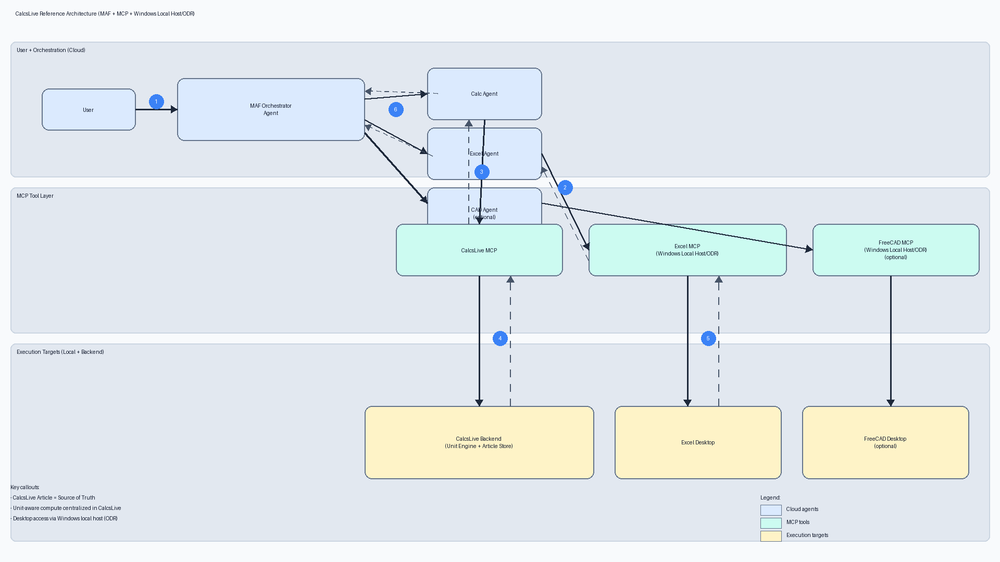

# CalcsLive Agent for Microsoft AI Dev Days Hackathon

**An Azure-orchestrated Agent transforming Excel into a Unit-Aware Engineering Tool**

CalcsLive Agent bridges the gap between Microsoft Excel and professional engineering calculations. Excel is fundamentally "unit-blind"—it doesn't understand the difference between inches, centimeters, or gallons. By orchestrating a local Excel Bridge API and the [CalcsLive](https://calcslive.com/) unit-aware calculation engine via Microsoft's Agent Framework (MAF) and Azure OpenAI, this project acts as a "System Utility" allowing users to execute complex engineering math directly alongside their spreadsheets using natural language.



## 🏆 Hackathon Compliance Matrix

This project strictly adheres to the core requirements of the Microsoft AI Dev Days Hackathon (February/March 2026):

| Requirement | Implementation Validation |
| :--- | :--- |
| **Azure AI Backend** | Uses `Azure OpenAI` deployments (`grok-3-mini` or `gpt-4o`) via the Azure Python SDK. Alternatively supports MAF Serverless Inference Endpoints. Configuration managed via `AZURE_AI_INFERENCE_ENDPOINT`. |
| **Agentic Frameworks** | Leverages the Azure AI Projects SDK / OpenAI API for tool-calling orchestration across distinct agent logic (Excel Agent vs CalcsLive Agent). |
| **Data / API Actions** | The Agent dynamically reads Excel PQ (Physical Quantity) tables locally, calls the remote CalcsLive REST API to run math logic with unit awareness, and mutates the local Excel state with the outputs. |
| **Microsoft Tooling** | Deep integration with local **Excel 2016 Pro** via COM automation (`pywin32`) to achieve real-time, bidirectional spreadsheet interaction. |
| **Code Availability** | Hosted in this public GitHub repository. |
| **BONUS: Local OS Integrations** | We authored a Model Context Protocol (MCP) server for Excel (`excel-mcp`) and registered it with the **Windows On-Device Registry (ODR)**. See the note on Dev Preview limitations below. |

---

## ⚠️ A Note on Microsoft ODR (On-Device Registry) Integration

As part of the Hackathon's Local-Host OS bonus track, we built an MCP-compliant wrapper (`excel-mcp`) designed to expose Excel's COM automation bridge to any Windows 11 agent via the new ODR sub-system.

We successfully authored and registered the server (`odr mcp add` succeeded). 
However, invoking it (`odr mcp run`) returned an `AccessStatus=DeniedBySystem` error.

**Why?** The current Developer Preview of ODR restricts custom CLI server invocations unless the OS is placed into `TestMode` (`bcdedit.exe /set TESTSIGNING ON`). Unfortunately, our development machine is hardware-locked by a **Secure Boot Policy** that prevents boot-configuration modifications, blocking us from entering TestMode. Unlocking Secure Boot requires bios-level reconfiguration and BitLocker key recovery that falls outside the safety scope of this hackathon timeline.

**The Pivot:** We successfully documented the ODR limitation and pivoted our execution flow. The MVP architecture uses our fallback route: The Azure Agent directly invokes our local FastAPI Excel Bridge (`http://localhost:8001`) to accomplish the exact same orchestration loop reliably, proving the "System Utility" UX through a Streamlit Web Dashboard without violating local Windows security postures.

*See `docs/odr-validation-log-2026-02-27.md` and `docs/odr-runbook.md` for full verification evidence.*

---

## 🚀 Getting Started

To run the MVP End-to-End locally:

### 1. Prerequisites
- Windows OS with Microsoft Excel installed (tested on Excel 2016 Pro).
- Python 3.9+
- Azure OpenAI Inference Endpoint and Key.
- CalcsLive API Key (Optional but recommended for premium unit features).

### 2. Environment Setup
Clone this repository and set up your `.env` file in `azure-agent/`:
```env
AZURE_AI_INFERENCE_ENDPOINT=https://your-endpoint.openai.azure.com
AZURE_AI_INFERENCE_KEY=your_key_here
CALCSLIVE_API_KEY=your_calcslive_token
```

### 3. Start the Excel Bridge
Open a sample Excel workbook containing a Physical Quantity (PQ) table (e.g., `ExampleCalc-01.xlsx`).
```bash
cd excel-bridge
pip install -r requirements.txt
python main.py
```
*(Runs on `http://localhost:8001`)*

### 4. Launch the Streamlit System Dashboard
In a new terminal:
```bash
cd azure-agent
pip install -r requirements.txt
python -m streamlit run app.py
```

### 5. Orchestrate!
The Streamlit UI will open at `http://localhost:8501`. Prompt the agent:
> *"Please read the current Excel table, calculate the output values through CalcsLive, and write the answers back down to the spreadsheet."* 

Watch as the Azure Agent sequentially hits the `get_excel_health`, `read_excel_pq_table`, `calculate_with_calcslive`, and `write_excel_results` tools—updating your live Excel document in seconds!

---

## 📁 Repository Structure

*   `azure-agent/`: The core MAF Orchestrator logic (`agent_core.py`) and the Streamlit UX (`app.py`).
*   `excel-bridge/`: The local FastAPI server providing COM-level access to the active Excel window.
*   `excel-mcp/`: The experimental Model Context Protocol wrapper built for Windows ODR registration.
*   `demo/`: Screenshots and videos of the working MVP.
*   `docs/`: Architecture diagrams and ODR validation logs.
